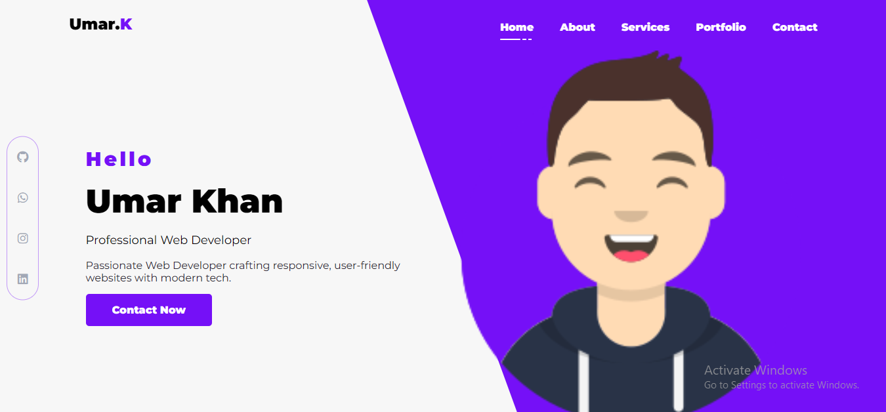
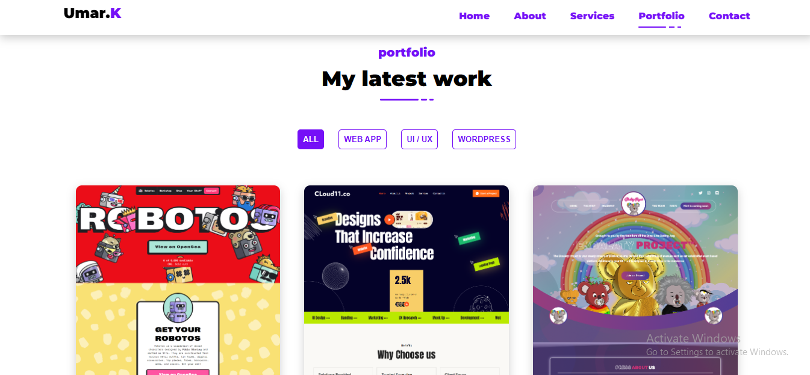

# Portfolio Website


A fully responsive personal portfolio website built with **HTML, CSS, and JavaScript**, showcasing professional projects, skills, and contact information. Designed with a clean UI/UX and optimized for performance.

---

## Features

- Responsive design for mobile, tablet, and desktop
- Project showcase with image previews and links
- About section highlighting skills and experience
- Contact form or contact links (GitHub, LinkedIn, Email)
- Smooth hover effects and animations for better UX

---

## Live Demo

[View Live Demo]([https://your-portfolio-link.com](https://umarkhann.netlify.app/))

---

## Screenshots

| Home Page                          | Projects Section                      |
| ---------------------------------- | ------------------------------------- |
|  |  |


## Setup

1. Clone the repository:

   ```bash
   git clone https://github.com/Umar-khan6/portfolio-website.git
   ```

2. Open `index.html` in your browser or use a local server.

---

## Deployment (GitHub Pages)

1. Push your code to a GitHub repository.
2. Go to **Settings → Pages**.
3. Under **Source**, choose `main` branch and `/root`.
4. Save — your site will be live at:  
   `https://yourusername.github.io/portfolio-website/`

---

## Technologies Used

- **HTML5**
- **CSS3 (Flexbox/Grid, Animations)**
- **JavaScript (Vanilla)**

---

## Contact

Feel free to connect with me:


- **LinkedIn:** [umarkhan24](https://linkedin.com/in/umarkhan42)
- **GitHub:** [Umar-khan6](https://github.com/Umar-khan6)
- **Email:** umarkhan655020@gmail.com
